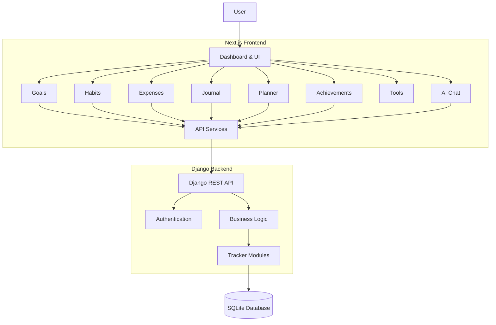
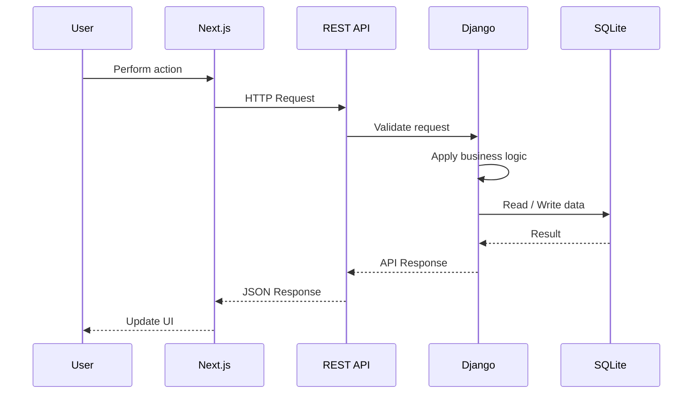
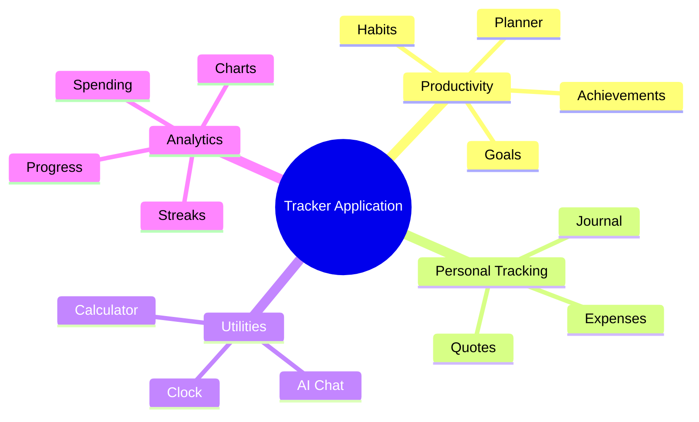

# Tracker Application

  <strong>A centralized personal productivity and life-tracking platform</strong>

  Track goals, habits, expenses, tasks, journals, achievements, and daily activities from a single dashboard.

---

## Overview

**Tracker Application** is a full-stack personal productivity system that centralizes different aspects of everyday tracking into one application.

Instead of maintaining separate applications for expenses, goals, habits, journaling, and planning, the platform provides a unified dashboard and shared data layer.

The application is built around modular frontend components and a Django REST API backend.

---

## Screenshots

> Add project screenshots to `docs/images/` and update the paths below.

### Dashboard

  

### Goals & Progress

  

### Expenses & Analytics

  

### Planner

  

---

## Core Features

| Module       | Description                                               |
| ------------ | --------------------------------------------------------- |
| Dashboard    | Centralized overview of productivity and personal metrics |
| Goals        | Create and track daily, monthly, and future goals         |
| Habits       | Track completion history and habit streaks                |
| Expenses     | Record expenses and analyze spending                      |
| Journal      | Maintain daily journal entries                            |
| Planner      | Organize tasks using a visual planning interface          |
| Achievements | Track milestones, badges, and rewards                     |
| Quotes       | Save and manage inspirational quotes                      |
| Tools        | Calculator, clock, and productivity utilities             |
| AI Chat      | AI-assisted productivity and application interaction      |

---

## Application Architecture

---

## Data Flow

---

## Feature Flow

---

## Technology Stack

### Frontend

| Technology    | Purpose                   |
| ------------- | ------------------------- |
| Next.js 15    | Application framework     |
| React 19      | UI development            |
| TypeScript    | Type safety               |
| TailwindCSS   | Styling and responsive UI |
| Framer Motion | UI animations             |
| Recharts      | Data visualization        |

###
