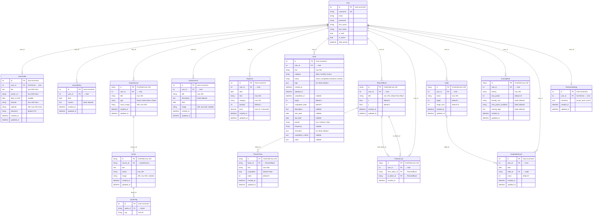

# Model Diagram

```mermaid
erDiagram
    User {
        int id PK "Auto-increment"
        string username UK
        string email
        string password
        string first_name
        string last_name
        bool is_staff
        bool is_active
        datetime date_joined
    }

    UserProfile {
        int id PK "Auto-increment"
        int user_id FK "OneToOne → User"
        text bio "max 500 chars"
        string avatar_url "max 500 chars"
        date date_of_birth "nullable"
        string location "max 100 chars"
        string website "URL max 200 chars"
        string timezone "default UTC"
        datetime created_at
        datetime updated_at
    }

    JournalEntry {
        int id PK "Auto-increment"
        int user_id FK "→ User"
        date date
        text content "blank allowed"
        datetime created_at
        datetime updated_at
    }

    QuoteSource {
        string id PK "CharField max 100"
        int user_id FK "→ User"
        string title "max 255"
        string type "Movie | Web Series | Book"
        string cover_image "URL max 500"
        datetime created_at
        datetime updated_at
    }

    Quote {
        string id PK "CharField max 100"
        string source_id FK "→ QuoteSource"
        text text
        string author "max 255"
        string image "URL max 500, nullable"
        datetime created_at
        datetime updated_at
    }

    QuoteTag {
        int id PK "Auto-increment"
        string quote_id FK "→ Quote"
        string tag "max 50"
    }

    Achievement {
        int id PK "Auto-increment"
        int user_id FK "→ User"
        string title "max 255"
        text description "blank allowed"
        date date
        string image "URL max 500, nullable"
        datetime created_at
        datetime updated_at
    }

    Expense {
        int id PK "Auto-increment"
        int user_id FK "→ User"
        date date
        string item "max 255"
        string category "max 100"
        int quantity "default 1"
        decimal price "max 10, 2 decimals"
        datetime created_at
        datetime updated_at
    }

    Goal {
        int id PK "Auto-increment"
        int user_id FK "→ User"
        string text "max 500"
        string category "daily | monthly | future"
        string status "active | completed | blocked | trashed"
        json tags "list, blank allowed"
        datetime created_at
        datetime updated_at
        datetime completed_at "nullable"
        int target "default 1"
        int completed_tasks "default 0"
        text description "nullable"
        date start_date "nullable"
        date due_date "nullable"
        string priority "low | medium | high"
        string frequency "nullable"
        json reminders "list, blank allowed"
        text completion_criteria "nullable"
        text notes "nullable"
    }

    PlannerBlock {
        string id PK "CharField max 100"
        int user_id FK "→ User"
        string title "max 255, default New Block"
        float x "default 0"
        float y "default 0"
        datetime created_at
        datetime updated_at
    }

    PlannerTask {
        string id PK "CharField max 100"
        string block_id FK "→ PlannerBlock"
        string text "max 500"
        bool completed "default False"
        int order "default 0"
        datetime created_at
        datetime updated_at
    }

    PlannerLink {
        string id PK "CharField max 100"
        int user_id FK "→ User"
        string from_block_id FK "→ PlannerBlock"
        string to_block_id FK "→ PlannerBlock"
        datetime created_at
    }

    PlannerSettings {
        int id PK "Auto-increment"
        int user_id FK "OneToOne → User"
        json transform "{scale, panX, panY}"
        datetime created_at
        datetime updated_at
    }

    Habit {
        string id PK "CharField max 100"
        int user_id FK "→ User"
        string name "max 255"
        int target "default 1"
        int range_max "default 10"
        datetime created_at
        datetime updated_at
    }

    ScoringRule {
        string id PK "CharField max 100"
        int user_id FK "→ User"
        string activity "max 255"
        int max_points "default 10"
        string penalty_rule "blank allowed"
        string zero_points_condition "blank allowed"
        text scoring_logic "blank allowed"
        datetime created_at
        datetime updated_at
    }

    DailyHabitScore {
        int id PK "Auto-increment"
        int user_id FK "→ User"
        date date
        string habit_id FK "→ Habit"
        int score "default 0"
        datetime created_at
        datetime updated_at
    }

    User ||--o| UserProfile : "user_id"
    User ||--o{ JournalEntry : "user_id"
    User ||--o{ QuoteSource : "user_id"
    User ||--o{ Achievement : "user_id"
    User ||--o{ Expense : "user_id"
    User ||--o{ Goal : "user_id"
    User ||--o{ PlannerBlock : "user_id"
    User ||--o{ PlannerLink : "user_id"
    User ||--o{ Habit : "user_id"
    User ||--o{ ScoringRule : "user_id"
    User ||--o{ DailyHabitScore : "user_id"
    User ||--o| PlannerSettings : "user_id"

    QuoteSource ||--o{ Quote : "source_id"
    Quote ||--o{ QuoteTag : "quote_id"
    Habit ||--o{ DailyHabitScore : "habit_id"
    PlannerBlock ||--o{ PlannerTask : "block_id"
    PlannerBlock ||--o{ PlannerLink : "from_block_id"
    PlannerBlock ||--o{ PlannerLink : "to_block_id"
```
